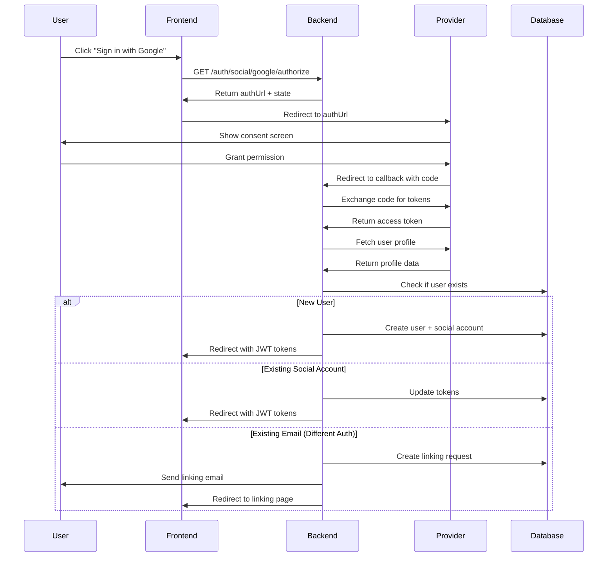

# Social Media Authentication

## Overview

This implementation provides comprehensive OAuth 2.0 social authentication for the Sai Mahendra Platform, supporting Google, LinkedIn, and GitHub as authentication providers. Users can sign in using their existing social media accounts, link multiple social accounts to a single platform account, and manage their authentication methods.

## Features

### ✅ Implemented Features

1. **Google OAuth Integration**
   - OAuth 2.0 with OpenID Connect
   - Profile retrieval (email, name, picture)
   - Token refresh support
   - Email verification auto-complete

2. **LinkedIn Authentication**
   - OAuth 2.0 for professional users
   - Professional profile data retrieval
   - LinkedIn API v2 support
   - Targeted for professional user base

3. **GitHub Authentication**
   - OAuth 2.0 for developers
   - Developer profile and repository access
   - Multiple email address support
   - Targeted for developer programs

4. **Account Linking**
   - Link social accounts to existing platform accounts
   - Email verification for security
   - Support for multiple social accounts per user
   - Prevent duplicate accounts
   - Unlink social accounts with safety checks

5. **Security Features**
   - Secure OAuth token storage (encrypted)
   - CSRF protection with state parameter
   - Secure redirect URI validation
   - Token encryption in database
   - Session management with Redis
   - Rate limiting on all endpoints

## Architecture

### Database Schema

```sql
-- Social provider enum
CREATE TYPE social_provider AS ENUM ('google', 'linkedin', 'github');

-- Social accounts table
CREATE TABLE social_accounts (
    id UUID PRIMARY KEY,
    user_id UUID REFERENCES users(id),
    provider social_provider NOT NULL,
    provider_user_id VARCHAR(255) NOT NULL,
    email VARCHAR(255),
    display_name VARCHAR(255),
    profile_picture_url VARCHAR(500),
    access_token TEXT NOT NULL,
    refresh_token TEXT,
    token_expires_at TIMESTAMP,
    profile_data JSONB,
    is_primary BOOLEAN DEFAULT false,
    created_at TIMESTAMP DEFAULT NOW(),
    updated_at TIMESTAMP DEFAULT NOW(),
    UNIQUE(provider, provider_user_id)
);

-- Account linking requests table
CREATE TABLE account_linking_requests (
    id UUID PRIMARY KEY,
    user_id UUID REFERENCES users(id),
    provider social_provider NOT NULL,
    provider_user_id VARCHAR(255) NOT NULL,
    email VARCHAR(255) NOT NULL,
    verification_token VARCHAR(255) UNIQUE NOT NULL,
    expires_at TIMESTAMP NOT NULL,
    status VARCHAR(50) DEFAULT 'pending',
    created_at TIMESTAMP DEFAULT NOW()
);
```

### Service Architecture

```
SocialAuthService (Orchestrator)
├── GoogleAuthService
│   ├── OAuth 2.0 flow
│   ├── Profile retrieval
│   └── Token refresh
├── LinkedInAuthService
│   ├── OAuth 2.0 flow
│   └── Profile retrieval
└── GitHubAuthService
    ├── OAuth 2.0 flow
    ├── Profile retrieval
    └── Email retrieval
```

### Authentication Flow



## Installation

### 1. Install Dependencies

```bash
cd backend/services/user-management
npm install
```

New dependencies added:
- `google-auth-library`: ^9.4.1
- `axios`: ^1.6.2

### 2. Run Database Migration

```bash
cd backend/database
npm run migrate
```

This will create the `social_accounts` and `account_linking_requests` tables.

### 3. Configure Environment Variables

Copy `.env.example` to `.env` and configure:

```env
# Google OAuth
GOOGLE_CLIENT_ID=your-google-client-id.apps.googleusercontent.com
GOOGLE_CLIENT_SECRET=your-google-client-secret
GOOGLE_REDIRECT_URI=http://localhost:3001/auth/social/google/callback

# LinkedIn OAuth
LINKEDIN_CLIENT_ID=your-linkedin-client-id
LINKEDIN_CLIENT_SECRET=your-linkedin-client-secret
LINKEDIN_REDIRECT_URI=http://localhost:3001/auth/social/linkedin/callback

# GitHub OAuth
GITHUB_CLIENT_ID=your-github-client-id
GITHUB_CLIENT_SECRET=your-github-client-secret
GITHUB_REDIRECT_URI=http://localhost:3001/auth/social/github/callback

# Frontend URL
FRONTEND_URL=http://localhost:3000
```

### 4. Set Up OAuth Applications

#### Google OAuth Setup
1. Go to [Google Cloud Console](https://console.cloud.google.com/)
2. Create project → Enable Google+ API
3. Create OAuth 2.0 Client ID
4. Add redirect URI: `http://localhost:3001/auth/social/google/callback`
5. Copy credentials to `.env`

#### LinkedIn OAuth Setup
1. Go to [LinkedIn Developers](https://www.linkedin.com/developers/)
2. Create app → Add "Sign In with LinkedIn using OpenID Connect"
3. Add redirect URL: `http://localhost:3001/auth/social/linkedin/callback`
4. Copy credentials to `.env`

#### GitHub OAuth Setup
1. Go to [GitHub Settings → OAuth Apps](https://github.com/settings/developers)
2. Create new OAuth App
3. Set callback URL: `http://localhost:3001/auth/social/github/callback`
4. Copy credentials to `.env`

## Usage

### API Endpoints

See [SOCIAL_AUTH_API_REFERENCE.md](./SOCIAL_AUTH_API_REFERENCE.md) for complete API documentation.

**Key Endpoints:**
- `GET /auth/social/:provider/authorize` - Get OAuth URL
- `GET /auth/social/:provider/callback` - Handle OAuth callback
- `POST /auth/social/:provider/link` - Link social account (authenticated)
- `POST /auth/social/confirm-linking` - Confirm account linking
- `GET /auth/social/linked` - Get linked accounts
- `DELETE /auth/social/:socialAccountId` - Unlink account
- `PUT /auth/social/:socialAccountId/primary` - Set primary account

### Frontend Integration

```typescript
// 1. Initiate OAuth flow
const response = await fetch('/auth/social/google/authorize');
const { authUrl } = await response.json();
window.location.href = authUrl;

// 2. Handle callback (on /auth/callback page)
const params = new URLSearchParams(window.location.search);
const accessToken = params.get('access_token');
const refreshToken = params.get('refresh_token');

// Store tokens and redirect to dashboard
localStorage.setItem('accessToken', accessToken);
localStorage.setItem('refreshToken', refreshToken);
window.location.href = '/dashboard';

// 3. Link additional social account (authenticated user)
const response = await fetch('/auth/social/github/link', {
  method: 'POST',
  headers: {
    'Authorization': `Bearer ${accessToken}`,
    'Content-Type': 'application/json'
  },
  body: JSON.stringify({ code: authorizationCode })
});
```

## Security Considerations

### Token Storage
- Access tokens are encrypted before storage in PostgreSQL
- Refresh tokens are encrypted when stored
- Tokens are never logged or exposed in error messages

### CSRF Protection
- State parameter generated for each OAuth flow
- State validated on callback
- State stored in Redis with 10-minute expiry

### Account Linking Security
- Email verification required for linking
- Verification tokens expire after 1 hour
- Prevents unauthorized account takeover
- User receives email notification

### Session Management
- JWT tokens with short expiry (15 minutes)
- Refresh tokens with longer expiry (7 days)
- All sessions terminated on password change
- Session data stored in Redis

### Rate Limiting
- 100 requests per 15 minutes per IP
- Applied to all social auth endpoints
- Prevents brute force attacks

## Testing

### Manual Testing

1. Start the service:
```bash
npm run dev
```

2. Test Google OAuth:
```bash
# Get authorization URL
curl http://localhost:3001/auth/social/google/authorize

# Visit the URL in browser and complete OAuth flow
```

3. Test account linking:
```bash
# Link GitHub account (requires valid access token)
curl -X POST http://localhost:3001/auth/social/github/link \
  -H "Authorization: Bearer YOUR_TOKEN" \
  -H "Content-Type: application/json" \
  -d '{"code": "authorization-code"}'
```

### Automated Testing

Run the test suite:
```bash
npm test
```

Test files:
- `src/__tests__/socialAuth.test.ts` - Social auth flow tests
- `src/__tests__/accountLinking.test.ts` - Account linking tests

## Monitoring and Logging

### Logged Events

All social authentication events are logged with context:

```typescript
Logger.info('Social authentication successful', {
  userId: user.id,
  provider: 'google',
  isNewUser: true,
  ip: req.ip,
  userAgent: req.get('User-Agent')
});

Logger.info('Social account linked', {
  userId: user.id,
  provider: 'github',
  socialAccountId: account.id
});

Logger.info('Social account unlinked', {
  userId: user.id,
  socialAccountId: account.id
});
```

### Metrics to Monitor

- OAuth success/failure rates by provider
- Account linking success rates
- Token refresh failures
- Average OAuth flow completion time
- Provider API response times

## Troubleshooting

### Common Issues

**Issue:** "Invalid redirect URI"
```
Solution: Ensure redirect URI in provider settings matches exactly
- Check protocol (http vs https)
- Check trailing slashes
- Check port numbers
```

**Issue:** "Failed to exchange authorization code"
```
Solution: 
- Verify client ID and secret are correct
- Check that code hasn't expired (single-use, 10-minute expiry)
- Ensure redirect URI matches exactly
```

**Issue:** "This social account is already linked"
```
Solution:
- User needs to unlink from other account first
- Or use a different email address
```

**Issue:** "Cannot unlink the only authentication method"
```
Solution:
- User must set a password before unlinking
- Or link another social account first
```

### Debug Mode

Enable debug logging:
```env
LOG_LEVEL=debug
```

This will log:
- OAuth request/response details
- Token exchange information
- Profile retrieval data
- Database queries

## Performance Considerations

### Caching

- User profiles cached in Redis for 1 hour
- OAuth tokens cached until expiry
- Provider public keys cached for 24 hours

### Database Optimization

Indexes created for:
- `social_accounts(user_id)`
- `social_accounts(provider, provider_user_id)`
- `account_linking_requests(verification_token)`
- `account_linking_requests(expires_at)`

### Rate Limiting

Provider-specific rate limits:
- **Google**: 10,000 requests/day (default)
- **LinkedIn**: 500 requests/day (default)
- **GitHub**: 5,000 requests/hour (authenticated)

## Future Enhancements

### Planned Features

1. **Additional Providers**
   - Microsoft/Azure AD
   - Facebook
   - Twitter/X
   - Apple Sign In

2. **Enhanced Security**
   - Two-factor authentication
   - Device fingerprinting
   - Suspicious login detection
   - IP-based restrictions

3. **User Experience**
   - Remember device
   - Biometric authentication
   - Passwordless login
   - Social profile sync

4. **Analytics**
   - Provider usage statistics
   - Conversion funnel analysis
   - User preference tracking
   - A/B testing support

## Support

For issues or questions:
- **Email**: support@saimahendra.com
- **Documentation**: https://docs.saimahendra.com
- **GitHub Issues**: https://github.com/saimahendra/platform/issues

## License

Copyright © 2024 Sai Mahendra Platform. All rights reserved.
